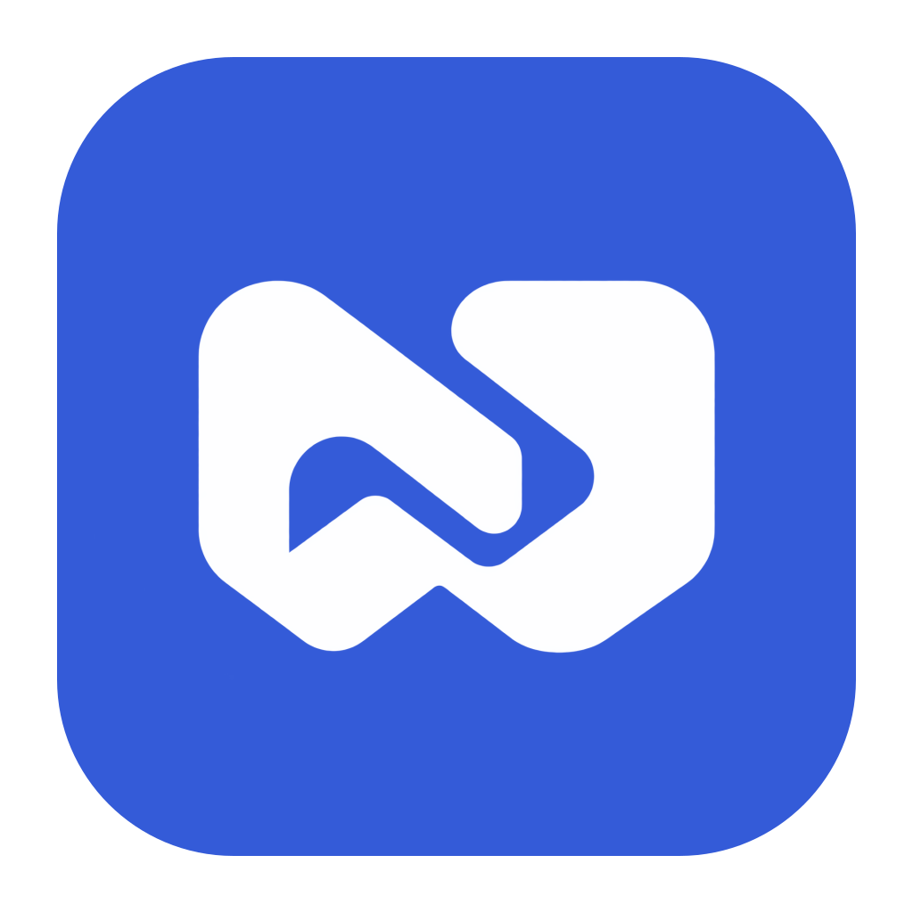

<p align="center">
  
</p>

<h1 align="center">Personal Agent Assistant</h1>

<p align="center">
  <a href="LICENSE"></a>
  <a href="#背景"></a>
</p>

<p align="center">连接会议记录与公司工作汇报，让 Agent 参与日常业务。</p>

个人工作助手提供两种使用方式：用桌面端记录会议、转写录音和生成纪要；用公司 Web 上报工作、整理日报／周报、查询团队进展和跟进待办。电脑与手机可访问同一个 Web 地址。

本仓库名为 `work-assistant-agent`，以 npm workspace 包 `personal-agent-assistant-workspace` 统一管理应用与共享代码；产品名称沿用 Personal Agent Assistant。

## 目录

- [背景](#背景)
- [安装](#安装)
- [使用](#使用)
- [部署与打包](#部署与打包)
- [开发](#开发)
- [数据与安全](#数据与安全)
- [文档](#文档)
- [维护者](#维护者)
- [如何贡献](#如何贡献)
- [许可证](#许可证)

## 背景

项目从两个实际需求出发：会议结束后记得重要结论和谁要做什么；员工随时汇报工作，让管理员及时了解进展与阻碍。

| 场景 | 当前能力 |
| --- | --- |
| 会议记录 | 麦克风录音、暂停／继续、本地保存、全文搜索、分页、回放与导出 |
| 本地转写 | tiny、base、small、medium、large-v3-turbo、large-v3；中文、英文、中英混合；参考机错误率与峰值内存 |
| 会议纪要 | 在线模型生成摘要、决策与行动项，引用可定位文字和录音 |
| 工作汇报 | 多会话助手、图文语音与文件上报、待确认工作进展、日报／周报 |
| 团队管理 | 员工账号、汇报规则、团队看板、按权限查询业务来源、管理员督办建议 |
| 模型服务 | 保存多家服务，获取模型列表，自定义推理预设、测试连接与用途分配 |

Electron 面向 macOS 和 Windows，会议资料保存在本机。公司 Web 使用独立服务端与 PostgreSQL，支持电脑和手机的响应式布局。**两者目前不自动同步会议、账号或模型配置。**

业务 Agent 采用 harness 组织模型、授权工具、任务状态、预算与人工确认。员工仅查询本人资料；管理员的团队问答限定于本公司授权的业务来源。工作建议需确认后落库，报告需本人提交。长期记忆、自动公司知识库以及原生 Android／iOS 客户端尚未接入。

## 安装

以下为源码开发步骤，所有命令从仓库根执行。只使用公司 Web 的员工无需安装开发工具；桌面安装包自带 Python 与运行依赖，转写模型在应用内下载。

### 依赖

| 使用方式 | 需要准备 |
| --- | --- |
| 公共工具链 | Node.js 24、npm 11、Python 3.12、Git |
| 公司 Web 开发 | Docker Desktop（或 Docker Engine＋Compose）、FFmpeg；PostgreSQL 由 Compose 启动 |
| 桌面开发 | macOS 或 Windows；录音时需要系统麦克风权限 |

```sh
git clone https://github.com/shi-YangYang/work-assistant-agent.git
cd work-assistant-agent
npm ci
```

`npm ci` 会下载 Electron 二进制，不下载转写模型。不要混用包管理器或另建 lockfile。Electron 下载失败时参考[官方安装说明](https://www.electronjs.org/docs/latest/tutorial/installation)。

<a id="公司工作助手-webspec-008"></a>

### 公司 Web

macOS／Linux：

```sh
python3.12 -m venv .venv-server
.venv-server/bin/python -m pip install -r services/company/requirements.lock
cp .env.company.example .env.company
```

Windows PowerShell：

```powershell
py -3.12 -m venv .venv-server
.venv-server\Scripts\python.exe -m pip install -r services/company/requirements.lock
Copy-Item .env.company.example .env.company
```

仅首次创建 `.env.company`；已有配置不要覆盖。编辑其中的 `POSTGRES_PASSWORD` 为长随机字母数字密码，并同步 `DATABASE_URL`。FFmpeg 不在 PATH 时设置 `PAA_FFMPEG` 为其可执行文件路径。

先启动 Docker，再依次执行；`--wait` 会等待数据库健康后返回：

```sh
docker compose --env-file .env.company -f deploy/company/compose.dev.yml up -d --wait
npm run db:company
node scripts/company/run.mjs model-key
npm run admin:company
```

`model-key` 初始化本地私有主密钥，不覆盖已有文件；`admin:company` 交互创建首家公司和管理员，不提供通用默认账号密码，也不会覆盖已有公司。已有环境升级时，先停服务并备份数据库与附件，更新依赖后执行 `npm run db:company`，无需重新创建账号或模型配置。

### Electron 桌面端

macOS：

```sh
python3.12 -m venv .venv
node scripts/desktop/install-python.mjs
```

Windows PowerShell：

```powershell
py -3.12 -m venv .venv
node scripts/desktop/install-python.mjs
```

桌面使用 `.venv`，公司服务使用 `.venv-server`，均不需要手动激活。解释器命令名称不同时，用对应的 Python 3.12 创建环境，不替换系统 Python。

## 使用

### 公司工作助手

```sh
docker compose --env-file .env.company -f deploy/company/compose.dev.yml up -d --wait
npm run dev:company
```

访问 **http://127.0.0.1:5174**。该命令同时启动 Web、API（8000）和 worker；`Ctrl+C` 一起停止应用进程，数据库继续运行。Web 支持热更新，修改 API 后需重启。只启 Web 不会启动后台任务处理。

1. 管理员登录后，在“成员管理”创建员工账号；员工首次登录修改临时密码。
2. 在“模型服务管理”添加服务，为工作助手、报告、语音分配模型。Base URL 需包含服务要求的版本路径，不自动补 `/v1`；获取目录失败可手填模型 ID。
3. 员工发送文字、图片、语音或文件，确认提取的工作进展，编辑并提交报告。
4. 管理员通过看板或助手了解授权范围内的团队工作，确认自己的督办待办。自动日报／周报需先在汇报规则中启用并配置时间。

文档支持 **PDF、DOCX、PPTX、TXT、JSON、MD、CSV**，可与图片混发：每次最多 4 个文件、合计 20 MiB，单张图片最多 5 MiB；语音单独发送，最长 3 分钟／20 MiB。原件可下载，提取内容可查看；当前不支持旧版 DOC／PPT，也不做扫描件 OCR。原生文字解析不需要模型密钥，AI 总结、图片理解和语音转写需要相应模型能力。

工作助手支持会话新建、搜索、重命名和删除。未配置模型时仍可管理账号、保存消息和手动编辑报告，AI 处理会保留输入并提示缺少配置。

### 桌面会议助手

```sh
npm run dev
```

1. 在“本地转写模型”下载模型并选择语言，默认 small／中文；没有模型也可以先录音。
2. 在“模型服务管理”配置在线模型，并选择“用于纪要”。可保存多家服务和自定义推理预设，默认使用流式接口。
3. 点击“开始会议”采集默认麦克风，随时暂停／继续。暂停不补静音，最小化或切换页面不中断录音。
4. 结束会议后补齐转写，并按设置自动生成纪要。可查看引用、定位录音、复制纪要，或导出 Markdown／TXT。

模型下载完成后可离线转写；错误率与内存数据是参考机实测，不代表所有录音场景。历史会议支持继续转写和重新转写；替换文字后旧纪要标为待更新，由用户手动重新生成。回放支持进度拖动、前后跳转 10 秒、倍速、音量与快捷键。

开发版优先使用 `.venv`，可通过环境变量 `PAA_PYTHON` 指定 Python 3.12 可执行文件路径；桌面不会自动加载 `.env`。麦克风被拒绝时，到系统隐私设置允许应用访问后重启；同一数据目录不要同时运行开发版和安装版。

## 部署与打包

### 公司 Web 部署

[生产 Compose](deploy/company/compose.yml) 在 Linux 上运行 Caddy、API、worker 和 PostgreSQL，自动先执行数据库迁移。Web 与 API 同源，通过 HTTPS 提供访问；数据库不暴露公网端口。服务器调用外部 AI／ASR API，不部署桌面的 faster-whisper。

部署前准备域名、Docker Compose 和 `.env.company`：

- 域名解析到服务器，开放 80／443；设置 `PAA_DOMAIN` 和 `PAA_WEB_ORIGIN=https://你的域名`。
- 设置数据库随机密码；在仓库与镜像之外创建一次 **32 字节随机主密钥文件**，所属 UID 为 `10001`、权限为 `600`。
- 将 `PAA_MODEL_KEY_HOST_PATH` 指向该文件的绝对路径。API 与 worker 只读共享它，文件缺失时不会自动创建；升级时不能重新生成。

```sh
docker compose --env-file .env.company -f deploy/company/compose.yml up --build -d
docker compose --env-file .env.company -f deploy/company/compose.yml exec api python -m paa_server.cli bootstrap-admin
```

部署完成后登录 Web 配置模型用途。手机录音需要有效 HTTPS，访问开发电脑的局域网 HTTP 地址不满足条件，也不保证锁屏后持续录音。当前单 worker 并发；**2 核 2 GB 仅为试点起点，尚无生产容量保证**，应结合实际人数和任务量评估。

#### 备份与恢复

升级前设置两个独立私有目录：`PAA_BACKUP_DIR` 存数据库／附件，`PAA_MODEL_KEY_BACKUP_DIR` 存主密钥，再从仓库根运行：

```sh
sh deploy/company/backup.sh
```

脚本会暂停写入服务，保存 PostgreSQL dump、附件、镜像信息与校验文件，然后恢复服务；业务备份保留最近 7 份，密钥备份独立保存。运维需将两类备份分别复制到受控异机位置。

恢复时验证两处 `SHA256SUMS`，停止写服务，用对应镜像将 dump 导入空库、还原附件，并安装同一时间戳的主密钥（UID `10001`／权限 `600`），核对后再启动。不要把新 schema 直接降级。主密钥丢失后旧凭证不可恢复，应先保留业务备份、撤销旧服务，再重新配置凭证。云端部署、容量与生产恢复仍需在目标环境验收。

### 桌面安装包

完成桌面开发环境安装后，在对应系统与架构执行：

```sh
node scripts/desktop/install-build-python.mjs
npm run package
```

产物位于 `dist/desktop/`：macOS ARM64 为 DMG，Windows x64 为 NSIS。安装包内置 Python、录音与转写依赖；模型仍由用户在应用内下载。`npm run package:dir` 只生成应用目录。

当前为测试分发，尚未接入正式签名、公证和自动更新。macOS 开发版与安装版切换或重新构建后，系统可能请求“个人工作助手 Safe Storage”钥匙串访问授权。安装与卸载不会清除用户会议、模型和服务配置。

## 开发

### 项目结构

```text
apps/desktop/         Electron、桌面界面与本地 Python 核心
apps/web/             公司 Web
services/company/     公司 API、worker、harness 与数据库迁移
packages/             HTTP 契约、模型参数校验、主题与品牌资源
tests/                桌面、Web、核心、服务端及 E2E 测试
scripts/              开发、安装、评测与打包脚本
deploy/company/       Docker Compose、Caddy 与备份脚本
docs/                 架构说明与文档导航
constitution/         产品使命、路线与技术约束
specs/                功能规格与验收记录
.ai/                  开发决策、规则与任务交接
```

两端共用 React／TypeScript 和界面主题；桌面通过 stdio 管理本地 Python 核心，公司服务使用 FastAPI、PostgreSQL 与持久化 harness。具体依赖版本和目录约定见[技术栈](constitution/tech-stack.md)。

### 常用命令

| 目的 | 命令 |
| --- | --- |
| 桌面开发／构建／构建后启动 | `npm run dev`／`npm run build`／`npm start` |
| 公司联合开发 | `npm run dev:company` |
| 单独启动 Web／API／worker | `npm run dev:web`／`npm run dev:server`／`npm run dev:worker` |
| 公司数据库迁移 | `npm run db:company` |
| 桌面类型／单元与 Python 检查 | `npm run typecheck`／`npm test` |
| Web 类型／单元／构建 | `npm run typecheck:web`／`npm run test:web`／`npm run build:web` |
| 公司后端测试 | `npm run test:server` |
| 格式／Lint | `npm run format:check`／`npm run lint` |

按改动范围选择检查，不要求每次全部运行。`test:server` 使用独立的 `DATABASE_TEST_URL`：先创建测试库并临时以该库的 `DATABASE_URL` 执行迁移，再恢复开发地址；不能指向日常数据库。定向测试示例：`npm run test:server -- tests/server/test_boundaries.py`。自动测试使用受控模型响应，不调用付费服务。

### CI 分层

[CI 工作流](.github/workflows/ci.yml) 在面向 `main` 的 PR 创建或更新时运行。普通 `dev`／`main` 推送不触发；如果 `dev` 已有开放 PR，推送会更新 PR 并触发检查。汇总结果为 **CI required**。

| 触发方式 | 检查范围 |
| --- | --- |
| PR／手动 `quick` | macOS 15、Windows 2025 的桌面单元与模块测试、普通构建；格式、Lint、桌面类型在 macOS 检查；Ubuntu 24.04＋PostgreSQL 检查公司 API 与 Web |
| 手动 `desktop` | 基础检查＋受控桌面流程 |
| 手动 `asr` | 基础检查＋真实 small 推理与桌面转写 |
| 手动 `package` | 基础检查＋冻结运行时、安装包启动／清理及随包模型验证 |
| 手动 `full`／`v*` 标签 | 上述完整检查，不自动发布 |

真实麦克风、系统权限与录音效果在日常设备验收，CI 不依赖用户密钥、会议或物理设备。桌面交互验收使用根目录 `npm run dev` 和默认用户资料；自动故障测试使用临时数据，不操作日常资料。发布前检查可使用 `test:asr`、`test:smoke:quick`、`test:smoke:asr`、`test:package`；`test:package -- --runtime-only` 只检查运行时资源，不能代替模型或完整分发验证。详细约束见 [AGENTS.md](AGENTS.md#ci-减负与交付效率)。

## 数据与安全

| 数据 | 存放位置与边界 |
| --- | --- |
| 桌面会议、音频、转写与模型 | Electron 用户数据目录；macOS 通常为 `~/Library/Application Support/个人工作助手/`，Windows 为 `%APPDATA%/个人工作助手/` |
| 桌面模型密钥 | 系统加密保护后保存于 `model-services.json`；纪要发送转写文字，不发送原始录音 |
| 公司业务与文档内容 | PostgreSQL；原始附件在 API／worker 共用的私有目录，按账号与业务来源授权访问 |
| 公司模型密钥 | 数据库保存 AES-GCM 密文；主密钥为独立私有文件，本地默认 `data/company/model-master.key`，可用 `PAA_MODEL_KEY_FILE` 指定 |

在线模型会接收相关任务所需的文字、图片或语音，具体取决于用途；测试连接也可能计费。默认只允许公共 HTTPS 模型地址，私有网关需由部署方通过 `PAA_MODEL_ALLOWED_ORIGINS` 放行精确源站。

员工未发送的输入和未提交报告仅本人可见；已发送工作消息与附件可由管理员查看，但助手团队检索进一步限定于已确认工作、已提交报告及关联来源。删除会话保留已被业务引用的材料；管理员删除报告会清理其引用的原始消息与附件，相关其他业务记录保留但来源标为已删除。

桌面备份应关闭应用后复制整个用户数据目录，不能只复制 SQLite 而遗漏 WAV；迁移前会备份数据库，回退需匹配升级前数据库与音频，不手动改 schema 版本。公司备份必须同时覆盖数据库、附件和独立主密钥。不要提交 `.env.company`、密钥、录音、模型、数据库或公司原始材料。

## 文档

- [技术架构](docs/architecture.md)：端、服务与 harness 的职责和边界。
- [项目使命](constitution/mission.md)与[路线图](constitution/roadmap.md)：产品方向与阶段目标。
- [技术栈](constitution/tech-stack.md)：实际依赖、目录和工程约束。
- [功能规格与验收](specs/README.md)：各项功能的范围、实现与验证结果。
- [转写模型实测](specs/spec-013-local-model-library/verification.md)：样本、错误率、内存和测试局限。
- [品牌资源](packages/ui-web/README.md)：两端共用 Logo 与图标的维护方式。

## 维护者

[小洋（@shi-YangYang）](https://github.com/shi-YangYang)。

## 如何贡献

欢迎通过 [Issues](https://github.com/shi-YangYang/work-assistant-agent/issues) 提问或反馈问题，也欢迎提交 PR。较大的功能或架构调整先讨论范围与方案；代码与文档变更遵循 [AGENTS.md](AGENTS.md)。

本项目日常开发使用长期 `dev` 分支，交付通过 `dev → main` PR 由维护者合并。提交前完成与改动范围相称的检查，不附带用户数据、真实凭证或无关改动。具体协作方式见 [Git 分支规则](.ai/rules/git-branch-workflow.md)。

## 许可证

[MIT](LICENSE) © 2026 小洋。
